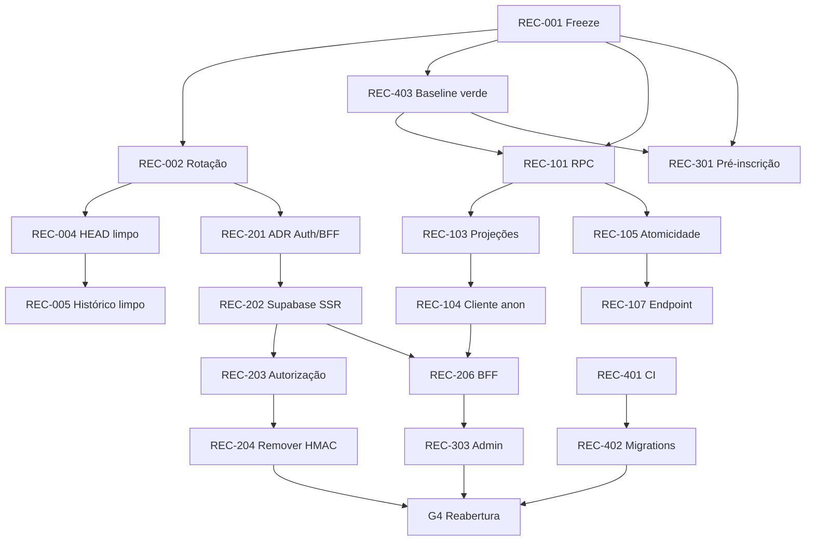

# Épica 17 — Recuperação SEV-0: Segurança, Integridade e Confiabilidade Operacional

**Status:** Validated — GO para decomposição formal das stories por `@sm`; implementação continua condicionada à validação individual de cada story. Fechadas em 2026-07-15 (`*close-story` @po, QA PASS): REC-403, REC-302, REC-401, REC-402, REC-301 (gate promovido CONCERNS → PASS 100/100 após verificação independente da suíte Playwright integral). REC-001 segue `Ready` (trabalho operacional não iniciado). Pendência não bloqueante em REC-301: 16 baselines PNG regenerados em `tests/baseline/` aguardando decisão de commitar/descartar.
**Prioridade:** P0 / SEV-0
**Tipo:** Programa brownfield de recuperação, executado em ondas com gates fail-closed
**Owner de produto:** `@pm` (Morgan)
**Coordenação operacional:** coordenador do incidente nomeado no início da Onda 0
**Fonte de requisitos:** auditoria técnica, funcional, de segurança e UX aprovada pelo usuário em 2026-07-14, seguida do plano detalhado de recuperação aprovado com o comando “comece”
**Formalização posterior:** um PRD brownfield interativo completo deverá consolidar decisões de produto e arquitetura depois da contenção. A task `brownfield-create-epic` não foi usada porque seu escopo formal é limitado a 1–3 stories pequenas e de baixo risco; esta recuperação é multiépica, crítica e de alto risco.

---

## 1. Propósito

Recuperar a aplicação RH Cursos de um estado incompatível com produção, eliminando primeiro as superfícies de comprometimento e os comportamentos enganosos e, depois, restaurando integridade transacional, identidade confiável, operação administrativa, qualidade e entrega segura.

O programa trabalha por **redução verificável de risco**. Um módulo permanece indisponível quando não consegue provar seu gate. Não será aceito “funciona manualmente” como evidência de segurança ou conclusão.

### Resultado de negócio esperado

- Usuários públicos não recebem dados privados nem dados internos de operação.
- Nenhuma interface declara pagamento, inscrição ou lead concluído sem confirmação persistida pelo servidor.
- O catálogo público permanece disponível com privilégio mínimo e falha de modo seguro.
- Administradores, instrutores e alunos são identificados por uma única autoridade de autenticação.
- Inscrições respeitam capacidade, idempotência e concorrência.
- O admin carrega dados reais e preserva comportamento após reload.
- Deploys só ocorrem depois de migrations e gates de qualidade aprovados.
- Credenciais, sessões e mecanismos comprometidos não podem ser reativados por rollback.

---

## 2. Rastreamento dos achados aprovados

Os requisitos desta épica derivam exclusivamente dos achados abaixo, já apresentados e aprovados no plano de recuperação.

| ID | Achado verificável | Consequência |
|---|---|---|
| FND-01 | Segredos operacionais e credencial administrativa foram versionados em configuração do repositório | Tratar valores e sessões relacionados como comprometidos |
| FND-02 | RPC pública de inscrição pode alterar PII de aluno existente a partir do e-mail | Violação de identidade e integridade de dados |
| FND-03 | Cliente SSR público prefere `service_role` e consulta dados sem filtragem defensiva completa | Bypass de RLS e exposição de dados não públicos |
| FND-04 | Sessão administrativa própria usa HMAC, `localStorage` e não possui revogação confiável | Autorização pode permanecer válida após mudança de papel ou bloqueio |
| FND-05 | Checkout coleta cartão/CVV, simula cupom e confirma compra sem gateway | Comportamento enganoso e coleta indevida de dados financeiros |
| FND-06 | Formulários públicos podem mostrar sucesso apesar de falha de persistência | Perda silenciosa de leads e falsa confirmação ao usuário |
| FND-07 | Login de aluno/instrutor e recuperação estão incompletos ou quebrados | Jornadas de acesso indisponíveis ou inconsistentes |
| FND-08 | Listas administrativas de alunos/inscrições não hidratam corretamente após reload | Operação administrativa não confiável |
| FND-09 | Rate limit aceita identificação de cliente falsificável | Proteção contra abuso pode ser contornada |
| FND-10 | Respostas públicas expõem contato de instrutor e observações internas de turma | Exposição de PII e informação operacional |
| FND-11 | Inserção anônima de lead é permitida diretamente no banco | Abuso, spam e bypass das validações da aplicação |
| FND-12 | Contagem/reserva de vagas não é atômica | Overbooking sob concorrência |
| FND-13 | Exportação CSV não neutraliza fórmulas | Execução de fórmula ao abrir arquivo exportado |
| FND-14 | Deploy não depende obrigatoriamente do CI e não aplica migrations como etapa ordenada | Código pode entrar antes do schema e com gates falhos |
| FND-15 | Cobertura mede um conjunto manual pequeno e a suíte agregada contém falhas | Sinal de qualidade não representa o sistema real |
| FND-16 | OpenAPI diverge das rotas e dependências possuem advisories conhecidos | Contrato e cadeia de suprimentos sem gate confiável |
| FND-17 | Controles de UI inertes, navegação móvel incompleta e lacunas de acessibilidade | Jornadas críticas inacessíveis ou enganosas |

---

## 3. Requisitos do programa

### Requisitos funcionais

- **FR-01:** O catálogo público deve usar exclusivamente credencial anon/publishable e projeções públicas com allowlist de colunas. Deriva de FND-03 e FND-10.
- **FR-02:** Leads e solicitações de inscrição devem entrar por endpoint server-side validado, idempotente e limitado. Deriva de FND-02, FND-09 e FND-11.
- **FR-03:** A reserva de vaga deve ser atômica e retornar conflito quando não houver capacidade. Deriva de FND-12.
- **FR-04:** Dados de aluno existente não podem ser alterados apenas pela coincidência de e-mail. Deriva de FND-02.
- **FR-05:** O checkout deve operar como pré-inscrição até existir pagamento server-side com gateway e webhook; nenhum dado de cartão deve transitar pela aplicação atual. Deriva de FND-05.
- **FR-06:** Formulários só podem confirmar sucesso depois de persistência confirmada. Deriva de FND-06.
- **FR-07:** Login, logout, renovação, revogação e papel devem usar Supabase Auth como autoridade única. Deriva de FND-04 e FND-07.
- **FR-08:** O admin deve buscar recursos por APIs autenticadas, paginadas e autorizadas, inclusive após reload. Deriva de FND-08.
- **FR-09:** Exportações devem neutralizar entradas interpretáveis como fórmulas. Deriva de FND-13.
- **FR-10:** Controles apresentados ao usuário devem funcionar ou ser removidos/explicitamente marcados como indisponíveis. Deriva de FND-17.

### Requisitos não funcionais

- **NFR-01 — Segurança:** todos os segredos expostos devem ser revogados antes da sanitização do histórico. Deriva de FND-01.
- **NFR-02 — Privilégio mínimo:** service role só pode existir em código server-only após autorização. Deriva de FND-03.
- **NFR-03 — Privacidade:** respostas, URLs, logs e métricas não devem expor PII desnecessária. Deriva de FND-02 e FND-10.
- **NFR-04 — Fail-closed:** falha de configuração, autorização ou proteção antiabuso deve bloquear operações sensíveis. Deriva de FND-03, FND-04 e FND-09.
- **NFR-05 — Integridade:** retries e concorrência não podem duplicar inscrições, leads ou reservas. Deriva de FND-06 e FND-12.
- **NFR-06 — Qualidade:** lint, typecheck, testes, build, banco, contratos, segurança e smoke devem bloquear deploy quando falharem. Deriva de FND-14 a FND-16.
- **NFR-07 — Acessibilidade:** jornadas críticas não podem conter violações sérias/críticas e devem funcionar por teclado. Deriva de FND-17.
- **NFR-08 — Roll-forward:** banco, credenciais e políticas de segurança são corrigidos para frente; rollback não pode restaurar estado comprometido. Deriva de FND-01, FND-02 e FND-11.
- **NFR-09 — Auditabilidade:** todo gate deve produzir evidência sanitizada, sem copiar segredo ou PII. Deriva de FND-01 e FND-10.

### Constraints de governança

- **CON-01:** nenhuma alteração de código começa sem story aprovada em `docs/stories/`.
- **CON-02:** criação detalhada das stories é autoridade de `@sm/@po`; esta épica define somente o backlog candidato.
- **CON-03:** push, PR, release, tags, secrets e deploy remoto são exclusivos de `@devops`.
- **CON-04:** decisões arquiteturais exigem `@architect` e devem ser registradas em ADR quando alterarem autoridade de sessão, BFF ou limites de serviço.
- **CON-05:** migrations e políticas de banco são executadas por `@data-engineer` e validadas por `@qa`.
- **CON-06:** veredito de qualidade e go/no-go pertence a `@qa`.
- **CON-07:** camadas L1/L2 do AIOX permanecem imutáveis.
- **CON-08:** troca de senha, ativação de MFA, decisões de indisponibilidade e avaliação legal/DPO que exigirem titularidade humana permanecem com o proprietário humano da conta ou responsável designado; `@devops` executa somente as operações técnicas autorizadas.

### Matriz de rastreabilidade

| Finding | Requisito derivado | Stories candidatas que entregam o requisito | Âncora local inicial |
|---|---|---|---|
| FND-01 | NFR-01, NFR-08, NFR-09 | REC-001 a REC-005 | `.claude/settings.json`, workflows e histórico Git |
| FND-02 | FR-02, FR-04, NFR-03 | REC-101, REC-105 a REC-107 | `supabase/migrations/20260513200000_sprint2_integrity.sql` |
| FND-03 | FR-01, NFR-02, NFR-04 | REC-103, REC-104, REC-206 | `src/lib/supabase/server.ts`, `src/lib/supabase/rh-cursos-api.ts` |
| FND-04 | FR-07, NFR-04 | REC-201 a REC-204 | `src/lib/auth-session.ts`, `supabase/functions/_shared/auth.ts`, `src/lib/app-store.tsx` |
| FND-05 | FR-05 | REC-301 | `src/views/public/CourseCheckout.tsx` |
| FND-06 | FR-06, NFR-05 | REC-107, REC-302 | `src/lib/app-store.tsx` e formulários públicos consumidores |
| FND-07 | FR-07 | REC-202, REC-305 | `app/login/page.tsx`, `src/views/public/Login.tsx`, `src/features/public/login/login-page.tsx` |
| FND-08 | FR-08 | REC-206, REC-303, REC-304 | `src/lib/app-store.tsx`, `supabase/functions/admin-resources/index.ts` |
| FND-09 | FR-02, NFR-04 | REC-107, REC-205 | `supabase/functions/_shared/auth.ts` e endpoints públicos |
| FND-10 | FR-01, NFR-03 | REC-103, REC-104, REC-408 | migrations de acesso público e `src/lib/supabase/rh-cursos-api.ts` |
| FND-11 | FR-02, NFR-04 | REC-102, REC-107 | `supabase/migrations/20260604164120_content_access_alignment.sql` |
| FND-12 | FR-03, NFR-05 | REC-105, REC-107 | RPC/migrations de inscrição |
| FND-13 | FR-09 | REC-307 | `src/lib/utils/csv-export.ts` |
| FND-14 | NFR-06, NFR-08 | REC-401, REC-402 | `.github/workflows/ci.yml`, `deploy-functions.yml`, `deploy-frontend.yml` |
| FND-15 | NFR-06 | REC-403 a REC-405 | `vitest.config.ts`, scripts de teste e suíte existente |
| FND-16 | NFR-06 | REC-406, REC-407 | `docs/api/openapi.yaml`, `package.json`, lockfile |
| FND-17 | FR-10, NFR-07 | REC-306, REC-308 | views públicas/admin e testes de jornada/acessibilidade |

Cada story deve substituir a âncora inicial por referência precisa de arquivo, cenário ou evidência sanitizada. A conversa que autorizou a execução é evidência de prioridade, mas não substitui evidência técnica versionada.

### Ações exclusivamente humanas

| Ação | Responsável humano | Apoio dos agentes |
|---|---|---|
| Confirmar titularidade e trocar senha/MFA quando o provedor exigir interação do dono | Proprietário da conta administrativa | `@devops` orienta e valida tecnicamente sem registrar credenciais |
| Avaliar obrigação de comunicação e impacto de dados | DPO/responsável legal | Coordenador fornece evidência sanitizada; agentes não emitem decisão jurídica |
| Autorizar indisponibilidade prolongada ou impacto comercial | Incident commander/stakeholder designado | `@po` apresenta impacto e alternativas fail-closed |
| Aprovar nova contratação ou gateway de pagamento | Stakeholder responsável | `@pm` conduz decisão em artefato posterior; fora desta onda |

---

## 4. Escopo

### Incluído

- Contenção de incidente e preservação de evidência.
- Revogação/rotação de credenciais e sessões comprometidas.
- Sanitização do HEAD e histórico Git após rotação.
- RLS, grants, RPCs, projeções públicas e integridade transacional.
- Cliente público anon e separação do cliente administrativo.
- Pré-inscrição segura e formulários de lead verdadeiros.
- Migração para Supabase Auth como identidade única.
- BFF canônico, autorização server-side e rate limit confiável.
- Read models administrativos.
- Correções funcionais, acessibilidade e remoção de controles inertes.
- CI/CD ordenado, cobertura real, contratos, segurança de dependências e smoke.
- Decomposição incremental do AppStore depois da estabilização.
- Observabilidade e fechamento pós-incidente.

### Excluído

- Redesign visual amplo não necessário para corrigir uma jornada crítica.
- Novas funcionalidades comerciais.
- Escolha ou implantação de gateway de pagamento nesta onda emergencial.
- Rewrite integral do frontend, banco ou AppStore.
- Mudanças em L1/L2 do framework AIOX.
- Decisões jurídicas não emitidas pelo responsável legal/DPO.
- Operações remotas executadas por agentes sem autoridade.

---

## 5. Estratégia de execução por ondas

### Onda 0 — Contenção SEV-0 (T+0 a T+2h)

**Objetivo:** interromper propagação do risco antes de qualquer correção funcional.

| Story candidata | Entrega mensurável | Executor | Validador | Dependências |
|---|---|---|---|---|
| REC-001 — Declarar incidente, freeze e preservar evidências | Deploys/merges suspensos; coordenador nomeado; logs preservados sem segredos | `@devops` + `@po` | `@qa` | Nenhuma |
| REC-002 — Revogar credenciais e sessões comprometidas | PATs, senha, sessões e segredo HMAC antigos rejeitados; MFA ativo | `@devops` + proprietário humano da conta quando exigido | `@qa` | REC-001 |
| REC-003 — Ativar indisponibilidade fail-closed quando necessário | Rotas administrativas e writes públicos bloqueados se a rotação não estiver propagada | `@devops` + `@dev` | `@qa` | REC-001 |
| REC-403 — Recuperar suíte agregada e estabelecer baseline verde | `npm test` e os gates constitucionais passam antes do primeiro merge de código da recuperação | `@dev` | `@qa` | REC-001 |

**Saída da onda:** Gate G0 aprovado.

**Regra constitucional da onda:** REC-001 e as operações remotas de contenção/rotação que não alteram código podem começar antes de REC-403. Nenhuma migration, hotfix ou alteração de código pode ser mergeada enquanto REC-403 não estiver `Done`, pois a Constitution exige `npm test` verde antes de merge.

### Onda 1 — Fechar ataques e comportamentos enganosos (T+2 a T+8h)

| Story candidata | Entrega mensurável | Executor | Validador | Dependências |
|---|---|---|---|---|
| REC-004 — Sanear configuração versionada | HEAD usa placeholders/env; scanner bloqueia novos segredos | `@devops` | `@qa` | REC-002 |
| REC-101 — Revogar RPC pública de inscrição | `anon` e papéis não autorizados recebem negação verificável | `@data-engineer` | `@qa` | REC-001, REC-403 |
| REC-102 — Revogar insert anônimo de leads | Insert direto anônimo falha; somente endpoint controlado persiste | `@data-engineer` | `@qa` | REC-001, REC-403 |
| REC-103 — Criar projeções públicas seguras | PII e observações internas ausentes de respostas públicas | `@data-engineer` | `@qa` | REC-101 |
| REC-301 — Converter checkout em pré-inscrição | Zero campos financeiros e zero alegação de pagamento; status pendente | `@dev` | `@po` + `@qa` | REC-001, REC-403 |
| REC-302 — Remover sucesso falso de formulários | Falhas 4xx/5xx/timeout preservam formulário e exibem erro | `@dev` | `@qa` | REC-001, REC-403 |

**Saída da onda:** operações públicas inseguras permanecem bloqueadas até G1/G2.

### Onda 2 — Integridade do caminho público (T+8 a T+24h)

| Story candidata | Entrega mensurável | Executor | Validador | Dependências |
|---|---|---|---|---|
| REC-104 — Implementar cliente público anon | Nenhum caminho público importa ou prefere service role | `@dev` | `@architect` + `@qa` | REC-103 |
| REC-105 — Corrigir inscrição atômica | Última vaga sob concorrência produz um sucesso e conflitos coerentes | `@data-engineer` | `@qa` | REC-101 |
| REC-106 — Proteger PII de aluno existente | E-mail sem identidade verificada não altera cadastro existente | `@data-engineer` + `@dev` | `@qa` | REC-105 |
| REC-107 — Endurecer endpoints públicos | Schema estrito, body limit, idempotência, CAPTCHA, rate limit público baseado no proxy confiável e status server-side | `@dev` | `@qa` | REC-102, REC-105 |
| REC-005 — Sanear histórico Git | Branches/tags limpos; scanner zero; clones antigos substituídos | `@devops` | `@qa` | REC-002, REC-004 |

**Saída da onda:** Gate G1 permite catálogo; Gate G2 pode permitir lead/pré-inscrição.

### Onda 3 — Identidade e entrega segura (T+24 a T+72h)

| Story candidata | Entrega mensurável | Executor | Validador | Dependências |
|---|---|---|---|---|
| REC-201 — ADR de autoridade de identidade e BFF | Supabase Auth como fonte única e limites do BFF registrados | `@architect` | `@po` | REC-002 |
| REC-202 — Implementar sessão Supabase SSR | Login/logout/refresh usam cookie seguro e identidade atual | `@dev` | `@qa` | REC-201 |
| REC-203 — Migrar autorização administrativa | Papel vem do servidor e rebaixamento bloqueia a requisição seguinte | `@dev` | `@qa` | REC-202 |
| REC-204 — Remover HMAC, `localStorage` e header próprio | Tokens legados são rejeitados e código morto removido | `@dev` | `@qa` | REC-203 |
| REC-205 — Expandir rate limiting para identidade autenticada | A proteção pública de REC-107 é estendida para proxy confiável + usuário atual + operação; IP do browser continua ignorado | `@dev` + `@devops` | `@qa` | REC-107, REC-202 |
| REC-401 — Encadear CI e deploy | CI falho ou migration falha impede toda publicação posterior | `@devops` | `@qa` | REC-001 |
| REC-402 — Tornar migrations etapa obrigatória | `@data-engineer` define/testa a migration; `@devops` configura e opera a ordem banco → API/Functions → frontend | `@devops` + `@data-engineer`, cada qual em sua autoridade | `@qa` | REC-401 |

**Saída da onda:** Gate G3 permite admin reduzido; Gate G4 permite pipeline normal.

### Onda 4 — Estabilização funcional (Dias 4–7)

| Story candidata | Entrega mensurável | Executor | Validador | Dependências |
|---|---|---|---|---|
| REC-206 — Consolidar BFF canônico | Browser chama apenas same-origin; contratos duplicados removidos | `@dev` | `@architect` + `@qa` | REC-202, REC-104 |
| REC-303 — Implementar read models de alunos e inscrições | Reload, paginação e filtros retornam dados autorizados | `@dev` + `@data-engineer` | `@qa` | REC-203, REC-206 |
| REC-304 — Implementar demais read models administrativos | Cursos, turmas, instrutores, leads, conteúdo e métricas paginados | `@dev` + `@data-engineer` | `@qa` | REC-303 |
| REC-305 — Corrigir login dos três papéis e recovery | Destino deriva do papel server-side; recovery é real ou removido | `@dev` | `@qa` | REC-202 |
| REC-306 — Corrigir navegação e ações administrativas | Menu móvel acessível; ações inertes removidas ou implementadas | `@dev` + `@ux-design-expert` | `@qa` | REC-303 |
| REC-307 — Corrigir exportação CSV | Fórmulas neutralizadas em Excel, LibreOffice e Sheets | `@dev` | `@qa` | REC-303 |
| REC-308 — Corrigir acessibilidade crítica | Zero violações sérias/críticas nas jornadas críticas | `@dev` + `@ux-design-expert` | `@qa` | REC-301, REC-305, REC-306 |

### Onda 5 — Qualidade e sustentabilidade (Semana 2)

| Story candidata | Entrega mensurável | Executor | Validador | Dependências |
|---|---|---|---|---|
| REC-404 — Medir cobertura real | Allowlist artificial removida; baseline e ratchet documentados | `@dev` | `@qa` | REC-403 |
| REC-405 — Separar comparação visual da atualização | CI nunca atualiza baseline durante comparação | `@dev` | `@qa` | REC-401 |
| REC-406 — Sincronizar OpenAPI | Todas as rotas publicadas possuem contrato testado | `@dev` | `@qa` | REC-206 |
| REC-407 — Remediar dependências vulneráveis | Advisories tratados ou exceções temporárias justificadas e datadas | `@dev` + `@devops` | `@qa` | REC-401 |
| REC-408 — Endurecer CSP, cache, logs e privacidade | CSP única; auth `no-store`; logs sem tokens/PII desnecessária | `@dev` + `@devops` | `@qa` | REC-202, REC-206 |
| REC-501 — Decompor AppStore incrementalmente | Domínios extraídos sem duplicar autoridade do servidor | `@dev` | `@architect` + `@qa` | REC-303, REC-304 |
| REC-502 — Encerrar incidente e executar post-mortem | Gates, impacto, ações preventivas e owner/prazo registrados | `@po` + coordenador | `@qa` | G0–G4 |

---

## 6. Dependências críticas

Nenhuma story pode declarar dependência concluída sem evidência no arquivo da própria story.

### 6.1. Prioridade e estimativa para decomposição

As estimativas abaixo são faixas de complexidade para orientar o corte das stories, não compromisso de prazo. Uma story classificada como `L` deve ser dividida por `@sm` quando não conseguir manter um único resultado testável.

| Faixa | Stories | Complexidade inicial |
|---|---|---|
| **P0 — contenção remota imediata** | REC-001, REC-002, REC-003 | S–M; pode começar sem merge de código |
| **P0 — restaurar gate constitucional** | REC-403 | M; bloqueia todo merge de código/migration |
| **P0 — fechar escrita/exposição pública** | REC-004, REC-005, REC-101 a REC-107, REC-301, REC-302 | S–L; dividir REC-105/106/107 se a story exceder um contrato testável |
| **P0 — identidade e deploy confiáveis** | REC-201 a REC-205, REC-401, REC-402 | M–L; ADR REC-201 antecede implementação de auth |
| **P1 — operação e UX** | REC-206, REC-303 a REC-308, REC-404 a REC-408 | S–L; só entram após os gates P0 correspondentes |
| **P2 — sustentabilidade** | REC-501 | L; executar por strangler stories menores, nunca como rewrite |
| **P1 — fechamento obrigatório** | REC-502 | M; não bloqueia contenção, mas bloqueia encerrar a épica |

Escala inicial: `S` até um dia de esforço focado; `M` entre um e dois dias; `L` acima de dois dias ou com múltiplos pontos de integração. O `@sm` deve registrar estimativa própria em cada story e preservar a prioridade desta matriz.

---

## 7. Acceptance Criteria da épica

### Contenção e credenciais

- [ ] **AC-17.01** — Todos os tokens, senhas, sessões e segredos identificados como expostos são rejeitados em teste negativo sanitizado.
- [ ] **AC-17.02** — MFA está ativo para contas administrativas e nenhuma credencial real está versionada.
- [ ] **AC-17.03** — Secret scan encontra zero segredo ativo no HEAD, branches e tags saneadas.

### Dados e privacidade

- [ ] **AC-17.04** — `anon` não executa RPC interna de inscrição nem insere lead diretamente.
- [ ] **AC-17.05** — E-mail/telefone do instrutor, identificadores privados e observações internas de turma não aparecem em HTML, JSON ou metadata pública.
- [ ] **AC-17.06** — Nenhuma rota pública usa service role ou `select('*')` sobre entidade que contenha campo privado.
- [ ] **AC-17.07** — Requisições concorrentes pela última vaga não geram overbooking.
- [ ] **AC-17.08** — Cadastro existente não é alterado apenas pela posse do e-mail.

### Verdade funcional

- [ ] **AC-17.09** — A aplicação não coleta cartão/CVV nem declara pagamento concluído sem arquitetura real de pagamento aprovada posteriormente.
- [ ] **AC-17.10** — Toda confirmação de lead/pré-inscrição corresponde a persistência server-side e possui identificador opaco.
- [ ] **AC-17.11** — Falha, timeout e conflito preservam os dados do formulário e exibem resposta compatível.

### Identidade e autorização

- [ ] **AC-17.12** — Supabase Auth é a única autoridade de identidade no browser e servidor.
- [ ] **AC-17.13** — Rebaixamento, desativação ou revogação bloqueia a próxima operação protegida.
- [ ] **AC-17.14** — HMAC próprio, sessão em `localStorage` e header próprio não participam do fluxo produtivo.
- [ ] **AC-17.15** — Aluno, instrutor e admin têm login/logout funcional e destino derivado do servidor.

### Operação, UX e entrega

- [ ] **AC-17.16** — Admin carrega alunos e inscrições após hard reload, com paginação, erro e retry.
- [ ] **AC-17.17** — Nenhum controle crítico visível permanece inerte; navegação móvel e teclado funcionam.
- [ ] **AC-17.18** — Jornadas críticas têm zero violação séria/crítica de acessibilidade.
- [ ] **AC-17.19** — Fórmulas CSV são neutralizadas para os prefixos `=`, `+`, `-`, `@`, tab e carriage return.
- [ ] **AC-17.20** — CI falho ou migration falha bloqueia deploy; migration precede API/Functions e frontend.
- [ ] **AC-17.21** — `npm run lint`, `npm run typecheck`, `npm test` e `npm run build` passam, além dos gates direcionados de banco, contrato, E2E, acessibilidade e secret scan.
- [ ] **AC-17.22** — Cobertura representa o código elegível real e não diminui após a adoção do baseline.
- [ ] **AC-17.23** — Smoke pós-deploy, alertas e métricas de erro/abuso estão ativos sem PII como label.

---

## 8. Quality gates e critérios de reabertura

### G0 — Incidente contido

Exige AC-17.01 e AC-17.02, freeze ativo, evidências preservadas e credenciais antigas comprovadamente inválidas.

### G1 — Catálogo público

Exige AC-17.04 a AC-17.06, cliente anon, filtros explícitos de publicação/exclusão e teste de draft/arquivado/PII.

### G2 — Leads e pré-inscrição

Exige AC-17.04 e AC-17.07 a AC-17.11, validação server-side, idempotência, body limit e rate limit confiável.

### G3 — Área administrativa

Exige AC-17.12 a AC-17.16, cache autenticado `no-store` e matriz negativa de RBAC.

### G4 — Deploy normal

Exige:

- `npm run lint` sem erros;
- `npm run typecheck` sem erros;
- `npm run test:unit` sem falhas;
- `npm test` sem falhas;
- `npm run build` concluído;
- `npm run build:workers` concluído;
- testes de banco/RLS;
- testes de contrato;
- `npm run docs:api:check-drift` sem drift;
- E2E smoke;
- acessibilidade das jornadas críticas;
- secret scan limpo;
- CodeRabbit sem issue CRITICAL;
- migration validada em homologação;
- smoke pós-deploy aprovado.

### G5 — Encerramento

Exige G0–G4, histórico saneado, impacto documentado, runbook atualizado e post-mortem com ações preventivas, responsáveis e prazos.

`@qa` possui autoridade para declarar PASS/CONCERNS/FAIL e bloquear qualquer gate.

---

## 9. Estratégia de roll-forward e rollback

| Domínio | Estratégia permitida | Estratégia proibida |
|---|---|---|
| Credenciais | Gerar nova credencial e revogar a anterior | Restaurar token, senha ou segredo comprometido |
| Histórico Git | Novo saneamento coordenado e reclone | Reintroduzir commits contendo segredo |
| RLS/grants/RPC | Migration corretiva forward-only | Restaurar grant público perigoso |
| Banco transacional | Migration forward-only compatível | Rollback destrutivo automático em produção |
| Catálogo | Voltar para versão anon segura ou indisponibilidade | Reativar service role público ou fixture silenciosa |
| Checkout | Voltar para pré-inscrição/indisponibilidade | Reativar campos financeiros simulados |
| Autenticação | Corrigir Supabase Auth para frente | Restaurar HMAC como autoridade |
| API/BFF | Wrapper temporário para contrato canônico | Manter duas autoridades de regra de negócio |
| Admin | Reverter UI mantendo autorização server-side | Confiar em papel enviado pelo browser |
| CI/CD | Suspender deploy até correção | Ignorar gate falho para publicar |

Toda story deve declarar a própria estratégia de rollback ou indicar explicitamente `roll-forward obrigatório`.

---

## 10. Evidências obrigatórias

Cada story derivada deve anexar ou referenciar evidência sanitizada para:

- critério de aceite executado;
- teste positivo e negativo;
- resultado de lint/typecheck/test/build aplicável;
- matriz de autorização quando houver papel;
- migration aplicada e reexecutada quando houver banco;
- logs/telemetria sem token, senha, e-mail ou telefone;
- rollback ou roll-forward validado;
- File List atualizada;
- veredito do `@qa`.

Não são evidências suficientes:

- descrição “testado manualmente” sem cenário e resultado;
- screenshot contendo PII ou segredo;
- teste que atualiza seu próprio baseline durante a comparação;
- execução parcial da suíte sem justificativa;
- waiver de segurança sem owner, prazo e mitigação compensatória.

---

## 11. Riscos do programa

| Risco | Probabilidade | Impacto | Mitigação |
|---|---|---|---|
| Credencial antiga permanecer válida em algum consumidor | Média | Crítico | Inventário por consumidor, teste negativo e fail-closed do admin |
| Migration emergencial bloquear jornada legítima | Média | Alto | Homologação, matriz de papéis e endpoint controlado antes da reabertura |
| Rewrite Git quebrar clones e branches | Alta | Médio | Rotacionar primeiro, janela coordenada, backup forense e reclone |
| Migração de auth gerar lockout | Média | Alto | Conta de teste, rollout reduzido e compatibilidade apenas de leitura por uma janela |
| Correção de inscrição introduzir deadlock | Baixa/Média | Alto | Ordem consistente de locks, timeout, retry limitado e teste concorrente |
| Pipeline publicar código incompatível com schema | Média | Crítico | Dependência obrigatória em migration e smoke pós-deploy |
| Escopo emergencial virar rewrite | Alta | Alto | Stories pequenas, fora de escopo explícito e aprovação de mudança pelo `@po` |
| Worktree existente ser sobrescrito | Média | Alto | Alterar somente arquivos da story e preservar mudanças não relacionadas |

---

## 12. Definition of Done do programa

A épica só pode mudar para `Done` quando:

- [ ] Todas as stories P0 estão `Done` com veredito PASS de `@qa`.
- [ ] Stories P1 necessárias a G3/G4 estão `Done`.
- [ ] AC-17.01 a AC-17.23 estão atendidos ou uma exceção não crítica possui owner, prazo e mitigação aprovada.
- [ ] Nenhuma exceção existe para segredo ativo, PII pública, service role pública, grant perigoso, checkout falso ou autoridade HMAC.
- [ ] G0 a G5 estão aprovados.
- [ ] O File List de cada story está reconciliado.
- [ ] Documentação e runbook refletem o comportamento real.
- [ ] Post-mortem e backlog residual foram aprovados pelo `@po`.

---

## 13. Próxima ação formal

1. `@po` valida prioridade, escopo, FRs/NFRs e critérios desta épica.
2. `@sm` cria primeiro as stories `REC-001`, `REC-002`, `REC-003`, `REC-101`, `REC-102`, `REC-301` e `REC-302` em `docs/stories/`.
3. `@architect` registra o ADR de identidade/BFF antes de `REC-202`.
4. `@qa` define os arquivos de gate para G0–G4.
5. Somente stories aprovadas passam para `InProgress`.
6. A formalização completa em PRD brownfield interativo ocorre depois da contenção, sem atrasar a Onda 0.

---

## 14. Referências locais iniciais

- `.claude/settings.json` — configuração versionada tratada como evidência do incidente.
- `src/lib/supabase/server.ts` — separação entre cliente público e privilegiado.
- `src/lib/supabase/rh-cursos-api.ts` — contratos e consultas do catálogo.
- `supabase/migrations/20260513200000_sprint2_integrity.sql` — RPC de inscrição.
- `supabase/migrations/20260604164120_content_access_alignment.sql` — grants/policies públicos.
- `supabase/functions/_shared/auth.ts` — autenticação legada.
- `supabase/functions/admin-resources/index.ts` — autorização e recursos administrativos.
- `src/views/public/CourseCheckout.tsx` — fluxo atual de checkout.
- `src/lib/app-store.tsx` — sessão e estado administrativo.
- `vitest.config.ts` — configuração atual de cobertura.
- `.github/workflows/ci.yml` — gates existentes.
- `.github/workflows/deploy-functions.yml` — deploy de Functions.
- `.github/workflows/deploy-frontend.yml` — deploy de frontend.

---

## 15. Validação formal de `@po` (Pax) — 2026-07-14

**Veredito: GO PARA DECOMPOSIÇÃO — 10/10 no checklist de readiness.**
**Readiness estimado:** 94% para decomposição; implementação permanece sujeita à validação individual de cada story e aos gates constitucionais.
**Tipo avaliado:** brownfield crítico com UI/UX e alto risco de integração.
**Bloqueadores para criação de stories:** 0.
**Bloqueadores para merge/deploy imediato de código:** REC-403 e os controles de REC-401/REC-402 aplicáveis à publicação.

| Critério de validação | Resultado | Rationale |
|---|---|---|
| 1. Título claro e objetivo | PASS | Identifica severidade, domínio e resultado esperado. |
| 2. Problema e necessidade completos | PASS | Propósito e FND-01 a FND-17 descrevem causa e impacto. |
| 3. Acceptance Criteria testáveis | PASS | AC-17.01 a AC-17.23 são verificáveis e conectados aos gates G0–G5. |
| 4. Escopo IN/OUT definido | PASS | Contenção, estabilização e exclusões estão explícitas; gateway e rewrite estão fora. |
| 5. Dependências mapeadas | PASS | Ondas, tabelas e grafo registram o caminho crítico e o fail-closed. |
| 6. Prioridade e complexidade | PASS | Matriz P0/P1/P2 e faixas S/M/L orientam o corte pelo `@sm`. |
| 7. Valor de negócio | PASS | Protege dados, restaura confiança funcional e viabiliza operação segura. |
| 8. Riscos documentados | PASS | Riscos, mitigação e estratégias proibidas de rollback estão registrados. |
| 9. Definition of Done | PASS | DoD, evidências sanitizadas, qualidade e gates de encerramento estão completos. |
| 10. Alinhamento e rastreabilidade | PASS | Findings → FR/NFR → stories → arquivos locais estão mapeados sem criar requisito comercial novo. |

### Condições de execução

1. Este GO autoriza `@sm` a criar stories; não autoriza implementação sem cada story passar de `Draft` para `Ready` por validação de `@po`.
2. `REC-001` e `REC-403` formam o primeiro par de stories. `REC-401`, `REC-402` e `REC-302` também podem ser criadas no primeiro lote para liberar o hotfix com sequência segura.
3. `REC-302` não pode ser mergeada enquanto o baseline constitucional de REC-403 estiver vermelho, nem publicada ignorando os controles de REC-401/REC-402 aplicáveis ao deploy.
4. Operações remotas, secrets, CI/CD, push e PR permanecem exclusivas de `@devops`; password/MFA e decisão legal permanecem com os responsáveis humanos definidos.
5. REC-201 deve registrar a decisão arquitetural antes de REC-202; nenhuma story pode antecipar tecnologia ou autoridade de sessão fora do ADR.
6. Toda story `L` com mais de um resultado independente deve ser dividida por `@sm` antes da validação.

### Stories autorizadas para criação imediata por `@sm`

1. **REC-001 — Declarar incidente, freeze e preservar evidências.**
2. **REC-403 — Recuperar suíte agregada e estabelecer baseline verde.**
3. **REC-401 — Encadear CI e deploy.**
4. **REC-402 — Tornar migrations etapa obrigatória.**
5. **REC-302 — Remover sucesso falso de formulários.**

Após REC-001 estar criada e validada, `@sm` pode decompor REC-002, REC-003, REC-101, REC-102 e REC-301 em paralelo, respeitando suas dependências de execução.

## 16. Change Log

| Data | Agente | Alteração | Decisão |
|---|---|---|---|
| 2026-07-14 | `@pm` (Morgan) | Criação da épica a partir da auditoria aprovada e autorização do usuário para iniciar. | Draft para validação. |
| 2026-07-14 | `@po` (Pax) | Adicionadas rastreabilidade finding→requisito→story, responsabilidades humanas, prioridade/complexidade, baseline constitucional REC-403 e separação de autoridades em migrations/deploy. | **GO para decomposição; 10/10.** |

---

**Criado em:** 2026-07-14
**Criado por:** `@pm` (Morgan)
**Última decisão:** `@po` aprovou a épica para decomposição; nenhum código, secret, operação remota ou story foi alterado nesta validação.
