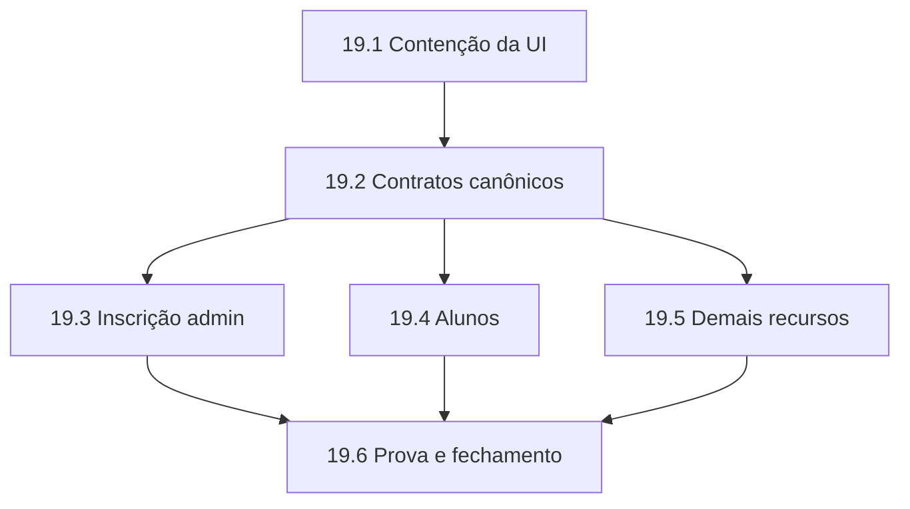

# Épica 19 — Integridade dos Contratos dos Formulários Administrativos

**Status:** Done — **PASS 10/10 no gate final**; implementação e persistência verificadas no banco isolado
**Tipo:** Brownfield — integridade de dados, contratos full-stack e remoção de controles enganosos
**Owner de produto:** `@pm` (Morgan)
**Origem arquitetural:** auditoria `@architect` (Aria) do fluxo campo → payload → BFF → Edge Function → Supabase
**Prioridade:** P1 — risco alto de divergência silenciosa e integridade administrativa; sem evidência de incidente ativo que justifique P0
**Data:** 2026-07-24
**Fontes:** `src/lib/admin-resource-configs.tsx`, `src/views/admin/AdminResourcePage.tsx`, `src/views/admin/AdminSettingsPage.tsx`, `src/lib/app-store.tsx`, `src/lib/supabase/admin-read-models.ts`, `supabase/functions/admin-resources/index.ts`, `supabase/functions/_shared/admin-validation.ts`, `supabase/functions/_shared/admin-mappers.ts`, migrations de inscrição REC-105/REC-106 e schema Supabase vigente

---

## 1. Objetivo

Garantir que todo controle editável do painel administrativo tenha um efeito persistente, validado e reproduzível apó reload; que controles sem persistência real sejam removidos ou convertidos em somente leitura; e que o backend seja a única autoridade para IDs, status, campos derivados, capacidade e respostas de mutação.

Ao final da épica, o comportamento imediato apó salvar deve ser igual ao comportamento observado depois de recarregar a página e consultar o banco.

## 2. Valor para o usuário

- O administrador não perde informações preenchidas silenciosamente.
- O painel deixa de declarar sucesso para alterações que não chegaram ao banco.
- Cadastro de aluno não apaga CPF, telefone ou cargo preexistentes.
- Inscrições administrativas passam a ter ID, status e pagamento coerentes.
- Relacionamentos editáveis sobrevivem ao reload.
- Erros de validação aparecem antes de constraints do Postgres e sem estado otimista falso.

## 3. Contexto do sistema existente

- **Frontend:** Next.js 16, React 19 e TypeScript, com formulário genérico dirigido por `FieldConfig`.
- **Estado:** `AppStore` monta objetos de domínio completos e invoca `admin-resources`.
- **Transporte:** browser → BFF same-origin autenticado → Supabase Edge Function.
- **Backend:** dispatcher genérico `admin-resources`, schemas Zod, mappers camelCase → schema Postgres e RPCs Supabase.
- **Banco:** Supabase/Postgres com tabelas `curso`, `turma`, `aluno`, `inscricao`, `lead`, `instrutor`, `curso_instrutor` e `post_blog`.
- **Padrões a preservar:** sessão Supabase SSR, autorização fail-closed, BFF same-origin, RLS/grants existentes, soft-delete onde vigente e design system Trust Keith.

### 3.1 Relação com épicas anteriores

- **Épica 10:** preserva busca, realtime, exportação e CRUD administrativo; esta épica corrige o contrato de persistência residual.
- **Épica 15:** preserva a fidelidade Trust Keith; remoção/readonly de controles deve reutilizar os componentes atuais.
- **Épica 17:** reutiliza os read models REC-303/REC-304, a atomicidade REC-105 e a proteção de PII REC-106; esta épica fecha divergências específicas do fluxo administrativo sem reabrir o incidente.
- **Épica 18:** não altera seu fechamento documental nem seus gates; novos contratos devem entrar no inventário/drift vigente.
- Nenhuma épica anterior é reaberta automaticamente. Findings desta épica viram stories 19.* ou follow-ups explicitamente aprovados pelo `@po`.

## 4. Diagnóstico factual

### 4.1 Controles sem persistência real

| Recurso       | Campo/controle                     | Estado verificado                                                                  |
| ------------- | ---------------------------------- | ---------------------------------------------------------------------------------- |
| Cursos        | `featuredCourseIds`                | Enviado pelo frontend, ignorado pelo mapper e reidratado como `[]`                 |
| Alunos        | `enrollmentStatus`                 | Não existe em `aluno`; escrita ignorada e leitura derivada de `inscricao`          |
| Leads         | `status` na criação                | UI permite selecionar, mas cliente e servidor forçam `Novo`                        |
| Leads         | `type` e `trainingTheme` na edição | Enviados pelo frontend, omitidos no objeto de update do backend                    |
| Inscrições    | `paymentMethod` na criação         | RPC vigente recebe o argumento, mas grava `forma_pagamento = NULL`                 |
| Instrutores   | `courseIds`                        | Multiselect existe, mas nenhum write sincroniza `curso_instrutor`                  |
| Instrutores   | upload de `photoUrl`               | UI gera Data URL; coluna de destino aceita URL de até 500 caracteres               |
| Configurações | identidade e notificações          | Persistência exclusiva em `localStorage`; não altera sistema, site ou notificações |

### 4.2 Divergências de integridade

1. A criação administrativa de inscrição reutiliza a RPC de pré-inscrição pública, cuja semântica é deliberadamente `Pendente` e sem pagamento.
2. O AppStore apresenta a nova inscrição como `Confirmada` antes do reload.
3. A RPC retorna `codigo_confirmacao`, mas o cliente o trata como `inscricao.id`.
4. Os schemas Zod fazem `parse`, porém o handler continua usando o payload bruto; transforms de CPF/telefone não se tornam a entrada aplicada.
5. Criar aluno com e-mail existente pode atualizar campos não presentes no formulário para `NULL` e redefinir `tipo_aluno`.
6. Alunos sem inscrição podem desaparecer depois do reload porque o read model parte de `inscricao INNER JOIN aluno`.
7. O upsert de curso pode reenviar `studentsCount` e sobrescrever `total_alunos`, apesar de o contador ser derivado de inscrições.
8. `durationLabel` remove todos os caracteres não numéricos; textos com mais de um número produzem carga horária incorreta.
9. Preço de turma não está no schema server-side e depende da constraint do banco para rejeitar valor negativo.

## 5. Decisões de produto e arquitetura

### D19-01 — Regra de honestidade da interface

Todo campo visível deve ser classificado como:

1. editável e persistido;
2. somente leitura e derivado; ou
3. deliberadamente local, com rótulo inequívoco de escopo.

Controles fora dessas categorias são bloqueantes e devem ser removidos ou desabilitados.

### D19-02 — Backend como autoridade de mutação

O frontend não cria IDs canônicos, status, timestamps nem projeções de sucesso. Toda mutação retorna o registro persistido e o AppStore substitui/insere exatamente essa resposta.

### D19-03 — DTOs allowlist por recurso

Mutações administrativas usam contratos específicos de create/update. Campos derivados ou gerenciados por triggers não fazem parte dos DTOs administrativos.

### D19-04 — Aluno não possui status de matrícula

`enrollmentStatus` sai do formulário de aluno. Status é apresentado como informação derivada das inscrições.

### D19-05 — Inscrição admin não reutiliza semântica pública

O fluxo administrativo deve ter operação/RPC transacional própria. A pré-inscrição pública permanece inalterada.

### D19-06 — Sem invenção de funcionalidades

- `featuredCourseIds` será removido nesta épica; uma relação de cursos relacionados exige requisito e modelagem posteriores.
- Upload em Supabase Storage não será criado; o campo de foto vira URL textual validada.
- Configurações institucionais globais e notificações reais não serão inventadas; controles locais saem da navegação produtiva.
- Nenhuma integração de gateway ou confirmação automática de pagamento faz parte desta épica.

## 6. Escopo

### IN SCOPE

1. Contenção imediata de controles editáveis sem efeito persistente.
2. DTOs e validação canônica para mutações administrativas.
3. Uso efetivo do resultado validado/transformado pelo Zod.
4. Respostas canônicas de create/update e reconciliação do AppStore.
5. Operação transacional de inscrição administrativa.
6. Read model de alunos baseado diretamente em `aluno`, com agregados de inscrição.
7. Proteção de PII em create/update por e-mail existente.
8. Sincronização de `instrutor.courseIds` com `curso_instrutor`.
9. Persistência completa dos campos editáveis de lead.
10. Carga horária numérica e proteção de `total_alunos`.
11. Validação server-side de preço e capacidade de turma.
12. Substituição do upload Data URL por URL textual validada.
13. Remoção da persistência administrativa enganosa em `localStorage`.
14. Testes campo → banco → reload para todos os formulários admin.
15. Atualização do contrato/documentação administrativa afetada.

### OUT OF SCOPE

- Nova tabela/relação de cursos relacionados.
- Supabase Storage, processamento ou otimização de imagens.
- Configurações institucionais globais e serviço de notificações.
- Gestão de administradores, Auth ou RBAC.
- Gateway de pagamento, conciliação financeira ou status `Pago` automático.
- Redesign visual amplo do painel.
- Reescrita integral do AppStore ou do dispatcher `admin-resources`.
- Push, PR, release ou deploy por agentes sem autoridade `@devops`.

## 7. Requisitos funcionais

### Contratos e estado

- **FR-19.01:** todo campo editável persistido deve manter o mesmo valor depois de reload, respeitadas transformações documentadas.
- **FR-19.02:** cada recurso deve possuir DTO allowlist de create/update; campos derivados não podem ser aceitos no contrato administrativo comum.
- **FR-19.03:** o handler deve aplicar ao banco exclusivamente o objeto retornado por `schema.parse`/`safeParse`.
- **FR-19.04:** create/update deve retornar o registro canônico persistido; o AppStore não pode fabricar sucesso, ID, status ou timestamp.
- **FR-19.05:** falha 4xx/5xx/timeout preserva o formulário aberto, seus valores e os erros por campo.

### Alunos e inscrições

- **FR-19.06:** o cadastro de aluno deve persistir e ser listado mesmo sem inscrição.
- **FR-19.07:** `enrollmentStatus` deve ser removido do formulário de aluno e exibido apenas como derivação de inscrições.
- **FR-19.08:** payload parcial de aluno nunca pode zerar CPF, telefone, cargo, tipo ou outro campo ausente.
- **FR-19.09:** a criação administrativa de inscrição deve persistir `forma_pagamento`, `tipo_inscricao`, `observacoes`, status definido pelo contrato e `turma_id`.
- **FR-19.10:** a operação administrativa deve retornar `inscricao.id` e `codigo_confirmacao` como propriedades distintas.
- **FR-19.11:** reserva de vaga, criação/reuso de aluno e criação de inscrição devem ocorrer atomicamente.
- **FR-19.12:** aluno existente localizado por e-mail deve ser reutilizado sem sobrescrita silenciosa de PII.

### Catálogo, leads e instrutores

- **FR-19.13:** `studentsCount`, `rating`, `filledSeats`, `availableSeats`, `slug` e timestamps não podem ser alterados por formulários que não os expõem.
- **FR-19.14:** carga horária deve ser capturada e enviada como inteiro não negativo; a apresentação `Nh` é derivada.
- **FR-19.15:** preço de turma deve ser validado no cliente, no contrato server-side e pela constraint existente.
- **FR-19.16:** capacidade final da turma deve ser calculada por autoridade server-side, sem confiar em `filledSeats`/`availableSeats` enviados pelo browser.
- **FR-19.17:** criação de lead deve assumir `Novo` sem apresentar seletor editável; edição deve persistir todos os campos editáveis, inclusive `type` e `trainingTheme`.
- **FR-19.18:** alterações em `instrutor.courseIds` devem sincronizar `curso_instrutor` atomicamente e sobreviver ao reload.
- **FR-19.19:** foto de instrutor deve aceitar somente URL HTTP(S) ou caminho permitido; Data URL deve ser rejeitada.

### Honestidade da interface

- **FR-19.20:** `featuredCourseIds` deve ser removido do formulário de curso e do DTO administrativo.
- **FR-19.21:** pagamento da inscrição deve permanecer oculto/desabilitado até a operação administrativa da FR-19.09 estar disponível no mesmo release.
- **FR-19.22:** `courseIds` do instrutor deve ser somente leitura ou oculto até a FR-19.18 estar disponível no mesmo release.
- **FR-19.23:** a página de configurações não pode oferecer `Salvar alterações` em `localStorage`; deve sair da navegação produtiva ou apresentar estado informativo sem controles editáveis.
- **FR-19.24:** campos contextuais somente leitura da inscrição devem permanecer identificados como não editáveis.

## 8. Requisitos não funcionais

- **NFR-19.01 — Integridade:** nenhuma mutação pode produzir diferença silenciosa entre estado local e banco.
- **NFR-19.02 — Segurança:** sessão SSR, autorização admin, rate limit, CORS, RLS/grants e sanitização de audit log permanecem fail-closed.
- **NFR-19.03 — PII:** CPF, telefone e demais dados pessoais não podem ser apagados ou sobrescritos por omissão de campo.
- **NFR-19.04 — Atomicidade:** criação administrativa de inscrição e sincronização N:N não podem deixar estado parcial.
- **NFR-19.05 — Compatibilidade:** jornadas públicas de lead e pré-inscrição permanecem byte/semanticamente inalteradas, salvo correção explicitamente coberta por outra story.
- **NFR-19.06 — Acessibilidade:** remoção, desabilitação e estados somente leitura devem preservar nome acessível, foco, erro e navegação por teclado.
- **NFR-19.07 — Performance:** nenhuma mutação deve introduzir N+1; sincronizações e read models devem usar consultas limitadas e índices existentes ou justificados.
- **NFR-19.08 — Observabilidade:** erros retornam código/mensagem operacional sem PII; audit log identifica recurso, ação e ID primário real.
- **NFR-19.09 — Qualidade:** lint, typecheck, testes unitários, banco, build e E2E administrativo passam no mesmo SHA de fechamento.

## 9. Disposição dos campos afetados

| Campo                          | Contenção                              | Estado final nesta épica                                             |
| ------------------------------ | -------------------------------------- | -------------------------------------------------------------------- |
| Curso `featuredCourseIds`      | Remover                                | Permanece removido; reintrodução exige requisito/modelagem posterior |
| Curso `durationLabel`          | Manter sem ampliar uso                 | Substituir por `durationHours` numérico                              |
| Aluno `enrollmentStatus`       | Remover                                | Status somente leitura derivado de inscrições                        |
| Lead `status` na criação       | Ocultar e assumir `Novo`               | Mantido editável apenas na edição                                    |
| Lead `type`/`trainingTheme`    | Somente leitura na edição até correção | Restaurar edição com persistência                                    |
| Inscrição `paymentMethod`      | Ocultar/desabilitar                    | Restaurar com RPC admin e persistência real                          |
| Instrutor `courseIds`          | Somente leitura/ocultar                | Restaurar multiselect com sincronização N:N                          |
| Instrutor `photoUrl`           | Remover upload Data URL                | Campo textual de URL validada                                        |
| Configurações locais           | Remover ação produtiva                 | Rota fora da navegação ou informativa, sem save local enganoso       |
| Inscrição `courseId`           | Manter                                 | Auxiliar legítimo para filtrar/resolver turma                        |
| Turma `manualFilledSeats`      | Manter                                 | Ajuste explícito; cálculo final server-side                          |
| Contexto readonly da inscrição | Manter                                 | Somente leitura, nunca reenviado como mutação                        |
| Blog                           | Manter                                 | Contrato atual preservado e coberto por teste de reload              |

## 10. Stories propostas para sharding pelo `@sm`

> As entradas abaixo são estrutura de produto. O `@sm` cria os arquivos completos em `docs/stories/`; o `@po` valida cada Draft antes de `Ready`.

### Story 19.1 — Conter controles administrativos sem persistência

**Objetivo:** remover ou tornar somente leitura os controles que atualmente aceitam alterações descartadas, sem mudar schema nem comportamento público.

```yaml
executor: "@ux-design-expert"
quality_gate: "@dev"
quality_gate_tools: [accessibility_check, design_review, component_validation]
assignment_basis: "executor-assignment: ui_ux"
```

**Aceite resumido:**

- Aplicar a coluna “Contenção” da matriz da seção 9.
- Nenhum controle oculto continua no payload por estado residual.
- Configurações deixa de declarar persistência sistêmica.
- Campos readonly preservam acessibilidade e contexto operacional.
- Testes de componente provam ausência dos controles editáveis inertes.

### Story 19.2 — Estabelecer contratos canônicos de mutação admin

**Objetivo:** introduzir DTOs allowlist por recurso, usar o resultado validado pelo Zod, retornar registros persistidos e reconciliar o AppStore sem objetos fabricados.

```yaml
executor: "@dev"
quality_gate: "@architect"
quality_gate_tools: [architecture_review, code_review, pattern_validation]
assignment_basis: "executor-assignment: code_general"
```

**Aceite resumido:**

- Contratos create/update separados e estritos para todos os recursos admin.
- Unknown/derived fields rejeitados ou descartados de forma explicitamente testada.
- `schema.parse` produz a entrada aplicada.
- Create/update retorna projeção canônica com ID real.
- AppStore usa a resposta; nenhum `Date.now()`/status default vira identidade persistida.
- `total_alunos`, ratings, capacidade e timestamps ficam fora dos DTOs comuns.

### Story 19.3 — Implementar inscrição administrativa transacional

**Objetivo:** separar o fluxo administrativo da pré-inscrição pública e garantir status, pagamento, capacidade, PII e identidade canônica.

```yaml
executor: "@data-engineer"
quality_gate: "@dev"
quality_gate_tools: [schema_validation, migration_review, rls_test]
assignment_basis: "executor-assignment: database"
```

**Aceite resumido:**

- Migration/RPC administrativa idempotente e transacional.
- Pré-inscrição pública permanece inalterada.
- `forma_pagamento`, `tipo_inscricao`, `observacoes` e status contratual persistem.
- Retorno diferencia `inscricao.id` de `codigo_confirmacao`.
- Aluno existente é reutilizado sem overwrite de PII.
- Concorrência de última vaga e duplicidade possuem testes de banco.
- Frontend restaura pagamento somente no mesmo release do backend.

### Story 19.4 — Corrigir fonte de verdade e integridade de alunos

**Objetivo:** listar alunos diretamente da entidade `aluno`, preservar dados parciais e apresentar matrículas/status como agregações derivadas.

```yaml
executor: "@dev"
quality_gate: "@architect"
quality_gate_tools: [architecture_review, code_review, pattern_validation]
assignment_basis: "executor-assignment: code_general"
```

**Aceite resumido:**

- Aluno sem inscrição permanece visível apó reload.
- Um aluno aparece uma vez, com contagem/atividade derivadas.
- Create/update parcial não envia `NULL` para campos ausentes.
- `enrollmentStatus` deixa de ser atributo editável do aluno.
- Paginação, busca e autorização fail-closed permanecem.
- Testes cobrem e-mail existente com CPF/telefone/cargo preservados.

### Story 19.5 — Alinhar catálogo, instrutores, leads e turmas

**Objetivo:** fechar as divergências restantes nos recursos administrativos sustentados pelo schema existente.

```yaml
executor: "@dev"
quality_gate: "@architect"
quality_gate_tools: [architecture_review, code_review, pattern_validation]
assignment_basis: "executor-assignment: code_general"
```

**Aceite resumido:**

- `instrutor.courseIds` sincroniza `curso_instrutor` atomicamente.
- Edição de lead persiste `type` e `trainingTheme`; criação não oferece status enganoso.
- Curso usa carga horária numérica e nunca escreve `total_alunos` pelo form.
- `featuredCourseIds` permanece ausente do contrato/UI.
- Preço e capacidade de turma têm validação server-side.
- Observação simulada oculta deixa de ser criada.
- Foto de instrutor usa URL/caminho permitido; Data URL é rejeitada.

### Story 19.6 — Provar persistência campo a campo e fechar a épica

**Objetivo:** criar a matriz executável UI → payload → banco → reload, cobrir regressões e reconciliar documentação/contratos.

```yaml
executor: "@dev"
quality_gate: "@architect"
quality_gate_tools: [architecture_review, code_review, pattern_validation]
assignment_basis: "executor-assignment: code_general"
```

**Aceite resumido:**

- Testes de contrato cobrem todos os campos editáveis de Cursos, Turmas, Alunos, Leads, Inscrições, Instrutores e Blog.
- Cada cenário executa criar → consultar banco → reload → editar → consultar banco.
- Configurações e campos removidos possuem testes negativos de ausência.
- Testes provam que payload omitido não apaga PII.
- Documentação API/administrativa reflete os contratos efetivos.
- `@qa` emite verdict consolidado PASS/CONCERNS/FAIL antes de `Done`.

## 11. Dependências e sequenciamento



- 19.1 reduz risco sem migration e deve ser a primeira entrega.
- 19.2 é a fundação contratual obrigatória.
- 19.3, 19.4 e 19.5 podem seguir em paralelo apó 19.2, respeitando arquivos compartilhados do AppStore/dispatcher.
- 19.6 somente inicia apó merge lógico das três frentes funcionais.
- Execução paralela deve possuir ownership explícito para evitar conflitos em `app-store.tsx`, `admin-resource-configs.tsx` e `admin-resources/index.ts`.

## 12. Critérios de sucesso da épica

- [ ] 100% dos campos editáveis possuem destino persistente e teste de reload, ou foram removidos.
- [ ] Zero controles produtivos declaram salvamento exclusivamente em `localStorage` sem rotulagem local explícita.
- [ ] Nova inscrição administrativa apresenta o mesmo ID, status e pagamento antes e depois do reload.
- [ ] Cadastro/edição de aluno preserva PII ausente e alunos sem inscrição continuam listados.
- [ ] Vínculos de instrutor com cursos sobrevivem ao reload.
- [ ] Edição de lead persiste todos os campos ainda expostos.
- [ ] Curso editado não altera `total_alunos` e carga horária não sofre parsing ambíguo.
- [ ] Turma rejeita preço/capacidade inválidos antes de tocar o banco.
- [ ] Jornada pública de pré-inscrição e lead permanece sem regressão.
- [ ] Gates constitucionais e E2E administrativo passam no mesmo SHA.

## 13. Compatibilidade

- O BFF same-origin e a sessão Supabase SSR permanecem canônicos.
- A RPC pública `registrar_inscricao_publica` não muda de semântica.
- Soft-delete e RLS/grants vigentes não são enfraquecidos.
- Blog, exportação CSV, dashboard, páginas somente leitura e portais não recebem redesign.
- Contratos novos devem ser aditivos durante rollout; remoção de caminho legado ocorre somente apó testes e consumidores migrarem.

## 14. Riscos e mitigações

| Risco                                         | Severidade | Mitigação                                                                          |
| --------------------------------------------- | ---------- | ---------------------------------------------------------------------------------- |
| Migration/RPC admin alterar semântica pública | Crítica    | Nova operação isolada; testes de regressão da RPC pública                          |
| Perda de PII em update parcial                | Crítica    | DTO PATCH allowlist, testes com sentinelas e proibição de `undefined → null`       |
| Overbooking/estado parcial de inscrição       | Alta       | Transação/RPC e testes concorrentes no Postgres                                    |
| Estado otimista continuar divergente          | Alta       | Resposta canônica obrigatória e proibição de IDs/status fabricados                 |
| Sincronização N:N remover vínculos incorretos | Alta       | Diff transacional, constraints e teste de preservação de principal                 |
| Contenção remover capacidade necessária       | Média      | Matriz de disposição aprovada pelo `@po`; reintrodução no mesmo release do backend |
| Conflitos entre stories em arquivos centrais  | Alta       | Sequenciamento por ondas e ownership de arquivo no plano de execução               |
| Documentação e OpenAPI divergirem novamente   | Média      | Contract tests e drift gate na 19.6                                                |

## 15. Rollback

- **19.1 UI:** revert isolado restaura controles, sem mudança de banco.
- **19.2 contratos:** manter compatibilidade aditiva até consumidores migrarem; feature/capability gate permite retorno ao handler anterior.
- **19.3 migration/RPC:** criar função administrativa aditiva; rollback remove/revoga somente a nova função, sem tocar na RPC pública.
- **19.4 read model:** manter rota anterior disponível durante validação; rollback reponta leitura sem apagar alunos.
- **19.5 relacionamentos:** executar diff em transação; rollback restaura snapshot dos vínculos afetados no teste/homologação.
- Nenhum rollback pode apagar dados de aluno, inscrição ou auditoria.

## 16. Quality gates

### Antes de implementar

- [x] Epic validada pelo `@po` com decisão GO/NO-GO.
- [x] Stories criadas pelo `@sm` com ACs rastreáveis a FR/NFR desta épica.
- [ ] Stories 19.3 e 19.4 revisadas por `@data-engineer` quanto a transação, PII, queries e migrations.
- [ ] Contrato da 19.2 revisado por `@architect`.

### Pre-commit por story

- `npm run lint`
- `npm run typecheck`
- testes unitários/contratuais afetados
- testes SQL quando houver migration/RPC
- CodeRabbit sem issue CRITICAL

### Pre-PR/fechamento

- `npm test`
- `npm run build`
- `npm run docs:api:check-drift`
- E2E administrativo criar → banco → reload → editar
- regressão de lead e pré-inscrição pública
- `npm run devops:all`, operado conforme autoridade do `@devops`

## 17. Definition of Done

- [x] Stories 19.1–19.6 criadas pelo `@sm`, validadas pelo `@po` e concluídas pelos executores autorizados.
- [x] Todos os requisitos FR-19.* e NFR-19.* possuem evidência em código, banco, teste ou waiver explícito.
- [x] Matriz de disposição de campos corresponde ao comportamento produtivo.
- [x] Nenhum controle inerte permanece editável.
- [x] Nenhum campo derivado/gerenciado por trigger pode ser sobrescrito por payload comum.
- [x] Banco e UI convergem antes/depois do reload.
- [x] Documentação e contratos atualizados.
- [x] Gate final emitido pelo `@qa`.
- [x] Transição da Epic para `Done` aprovada pelo `@po`.

## 18. Handoff para validação do `@po`

Validar especialmente:

1. remoção de `featuredCourseIds` sem substituição nesta épica;
2. remoção definitiva de `enrollmentStatus` do formulário de aluno;
3. status `Novo` fixo na criação de lead;
4. persistência de forma de pagamento na inscrição administrativa, sem implicar pagamento confirmado;
5. retirada de Configurações da navegação produtiva;
6. foto de instrutor como URL textual, com Storage diferido;
7. prioridade P1 e sequenciamento 19.1 → 19.2 → 19.3/19.4/19.5 → 19.6.
8. necessidade ou dispensa formal de addendum no PRD/ADR antes do sharding, dado o risco alto e o escopo superior ao fluxo brownfield pequeno.

## 19. Handoff para sharding do `@sm`

> Apó GO do `@po`, criar seis stories brownfield a partir das seções 19.1–19.6. Cada story deve incluir YAML de executor/quality gate, File List, ACs rastreáveis, testes de reload, rollback e proibição de ampliar escopo. A 19.3 não altera a RPC pública; a 19.4 não apaga PII; a 19.5 não cria tabela de cursos relacionados nem Storage. A 19.6 exige verdict final de `@qa`.

## 20. Validação formal do `@po` (Pax) — 2026-07-24

**Veredito final: PASS — 10/10.**

Gate final: [`docs/qa/gates/epic-19-integridade-contratos-formularios-admin.yml`](../qa/gates/epic-19-integridade-contratos-formularios-admin.yml). Evidências: 767 testes unitários, 180 E2E, 113 testes de banco, anti-drift de 16 rotas, lint, typecheck e build aprovados.

### Evidências verificadas

- Diagnóstico fundamentado em arquivos concretos do fluxo campo → payload → BFF → Edge Function → Supabase.
- Seis stories 19.1–19.6 criadas pelo `@sm`, todas com objetivo, ACs, dependências, executor, quality gate, tarefas e File List.
- Rastreabilidade explícita entre FR/NFR, decisões D19-01–D19-06, matriz de disposição, riscos, rollback e Definition of Done.
- Sequenciamento seguro: contenção de UI → contratos canônicos → frentes transacional/read model/catálogo → prova final.
- Escopo e exclusões preservam Auth/RBAC, RLS, jornadas públicas, RPC pública de pré-inscrição, Storage e gateway de pagamento.
- Addendum de PRD/ADR dispensado para o sharding: a épica já contém decisões de produto, contratos, rastreabilidade e limites de escopo suficientes; qualquer mudança de autoridade, schema ou funcionalidade fora deste documento exige nova aprovação.
- As seis stories foram revisadas pelo `@po`, implementadas e encerradas como `Done`, cada uma coberta pelo gate final `PASS — 10/10`.

### Gates de execução concluídos

1. O contrato da Story 19.2 foi revisado por código, schemas strict, mappers e testes de contrato.
2. As Stories 19.3 e 19.4 foram verificadas por migration, RLS, PII, read model e `test:db`.
3. A Story 19.6 fechou a matriz campo → payload → banco → reload com verdict `PASS` de `@qa`.
4. O deploy de teste da Edge Function e das migrations foi validado antes do E2E completo.

Não há requisito inventado, conflito de escopo ou bloqueador crítico. A épica está concluída e pode permanecer em `Done` enquanto aguarda eventual promoção do release para produção.

---

## Change Log

| Data       | Versão | Mudança                                                                                                                              | Autor                                                  |
| ---------- | -----: | ------------------------------------------------------------------------------------------------------------------------------------ | ------------------------------------------------------ |
| 2026-07-24 |    0.1 | Criação da épica a partir da auditoria campo → backend e das decisões de contenção aprovadas na conversa                             | `@pm` (Morgan), com origem técnica `@architect` (Aria) |
| 2026-07-24 |    0.2 | Validação formal: GO condicional 9,2/10; sharding confirmado; condições técnicas e gates individuais mantidos antes da implementação | `@po` (Pax)                                            |
| 2026-07-24 |    0.3 | Validação individual das Stories 19.1–19.6 concluída; todas promovidas a `Ready` com GO 10/10. Prontidão documental da épica promovida a 10/10; gates técnicos permanecem pré-condições de execução. | `@po` (Pax) |
| 2026-07-25 |    1.0 | Implementação concluída; gate final PASS 10/10 com 767 unitários, 180 E2E, 113 testes de banco, anti-drift, lint, typecheck e build aprovados. | `@qa` (Quinn) / `@po` (Pax) |
