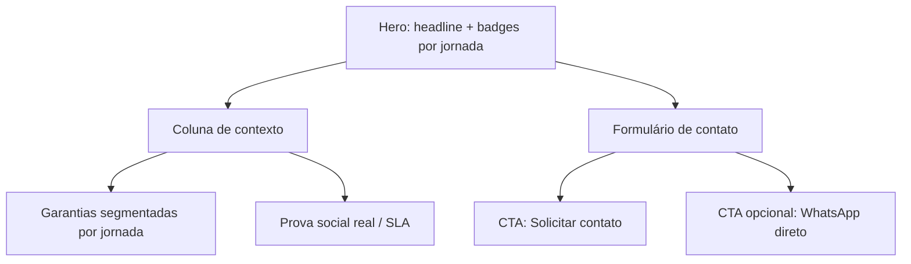
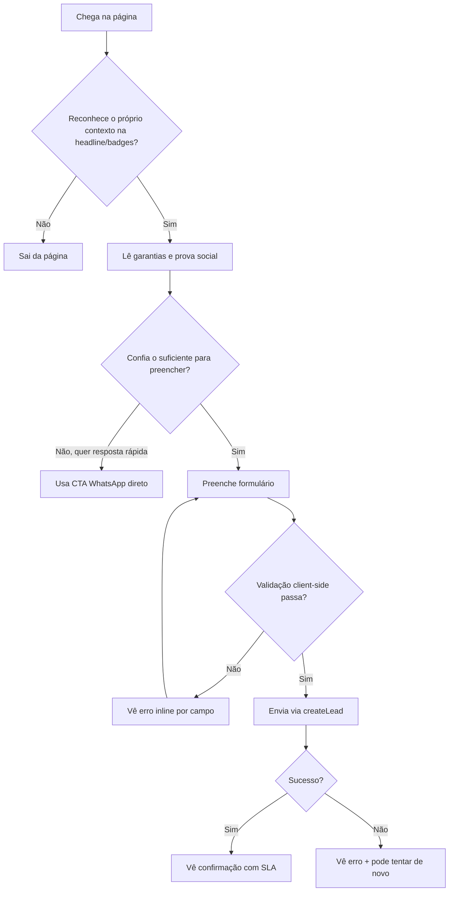

# RH Cursos — UI/UX Specification: Página de Consultoria

> Escopo: `src/views/public/SpecialistContact.tsx` (variantes `leadOrigin="Consultoria"` e `leadOrigin="Especialista"`).
> Base: `outputs/ux-research/consultoria/` (research-summary, personas, insights).

## 1. Introdução

Este documento define os objetivos de UX, o fluxo do usuário e as diretrizes visuais para as mudanças propostas na página de Consultoria/Especialista, com foco em **melhorar conversão do formulário** e **clarear a proposta de valor** entre as duas jornadas de lead (`Consultoria` para setor público/compliance e `Especialista` para atendimento genérico).

### 1.1 Metas e Princípios de UX

**Personas-alvo** (ver `outputs/ux-research/consultoria/personas.md`):
- **Regina** — gestora pública (jornada Consultoria): precisa de prova de contexto público e SLA antes de comprometer tempo com o formulário.
- **Carlos** — gerente de RH privado (jornada Especialista): decide rápido, abandona formulários longos sem sinal de urgência/retorno.

**Metas de usabilidade:**
- Redução de atrito: usuário entende em <10s se a página é para o caso dele (público vs privado).
- Confiança: usuário vê ao menos um elemento de prova social real antes do formulário.
- Previsibilidade: usuário sabe o prazo de resposta antes de enviar.

**Princípios de design:**
1. **Diferenciação real entre jornadas** — não só o hero muda; garantias e prova social também devem refletir o público.
2. **Reduzir o custo do primeiro passo** — menos campos obrigatórios, ou uma rota alternativa mais rápida (WhatsApp).
3. **Nenhuma alegação sem lastro** — números/depoimentos exibidos devem ser reais (Article IV — No Invention); até validação do time comercial, usar placeholders marcados como `TODO(dados-comerciais)`.
4. **Consistência com o design system existente** — reutilizar tokens `--tk-brand`, `--tk-success`, `--tk-error`, tipografia `font-tk-display`/`font-tk-serif` já em uso no componente.

### Change Log
| Date | Version | Description | Author |
|------|---------|-------------|--------|
| 2026-07-14 | 0.1 | Primeira versão, derivada da pesquisa `*research spec da pag de consultoria` | Uma (ux-design-expert) |

---

## 2. Arquitetura de Informação (escopo de página única)

Não há mudança de IA em nível de site — a página continua acessível pelas mesmas rotas/CTAs que hoje apontam para `SpecialistContactPage`. Mudança é de **conteúdo e estrutura interna da página**, não de navegação.

---

## 3. Fluxo do Usuário

### Fluxo: Solicitar contato de consultoria

**Objetivo do usuário:** obter um diagnóstico/orientação especializada sem perder tempo com um formulário genérico.
**Pontos de entrada:** header/menu "Consultoria", CTAs de landing pages segmentadas, link direto (`leadOrigin` na prop).
**Critério de sucesso:** lead enviado com `type: "Consultoria"` e área de interesse coerente com a dor real.

**Edge cases & error handling:**
- Falha de rede/`createLead` rejeitado → manter dados preenchidos, mostrar `submitError` (já implementado), não limpar o formulário.
- Usuário troca de jornada (ex.: veio de link errado) → considerar CTA leve "Não é o seu caso? Veja consultoria para [outro público]".
- Campo "mensagem" curto (<10 caracteres) → erro já existe; avaliar se deve deixar de ser obrigatório (Insight #3).

**Notas:** o botão CTA de WhatsApp direto é uma proposta nova (Insight #3) — requer decisão do time comercial sobre número/rota antes de implementar.

---

## 4. Wireframes & Mockups

**Arquivo de design primário:** nenhum (não há Figma/Sketch para este projeto no momento) — layout definido diretamente em código/Tailwind, como já é o padrão do repositório.

### Tela: Página de Consultoria / Especialista

**Propósito:** captar lead qualificado com confiança suficiente para preencher o formulário.

**Elementos-chave (deltas sobre o que já existe):**
- Faixa de prova social real (números/logos/depoimento de cliente) — **novo**, substitui ou complementa o card "Atendimento" atual.
- Microcopy de SLA próxima ao botão "Solicitar contato" — **novo**.
- `guarantees` (cards de garantia) segmentados por `leadOrigin` — **alteração**, hoje é lista única compartilhada.
- Options do `Select` "Área de interesse" ajustadas por jornada (Consultoria: normas/compliance; Especialista: temas gerais de RH) — **alteração**.
- CTA secundário "Falar agora no WhatsApp" — **novo**, opcional, pendente de validação comercial.

**Notas de interação:** manter toda a validação client-side existente (`validate()`), toasts (`sonner`) e estados `aria-invalid`/`aria-describedby` já implementados no `FormField`.

**Referência de arquivo/frame:** N/A (sem ferramenta de design externa).

---

## 5. Biblioteca de Componentes / Design System

**Abordagem:** reutilizar exclusivamente componentes já existentes em `src/components/ui/` (Button, Card, Input, Select, Textarea, FormField, Avatar) e os tokens em `src/design-tokens/tokens.css`. Nenhum componente novo é necessário para o escopo desta spec — apenas composição de conteúdo dentro do `Card` existente.

### Componentes centrais reaproveitados
| Componente | Propósito nesta página | Variantes/estados usados |
|---|---|---|
| `Card` / `CardContent` | Garantias, prova social, formulário | `border-outline-variant`, `bg-surface-container-lowest`, `shadow-card` |
| `FormField` | Wrapper de campo com erro/aria | `error`, `required` |
| `Input` / `Textarea` / `Select` | Campos do formulário | padrão + `aria-invalid` |
| `Button` | CTA principal | `size="lg"`, `loading` |
| `Avatar` / `AvatarFallback` | Retrato do atendimento/depoimento | iniciais |

Se a "faixa de prova social" exigir um layout que os componentes atuais não cobrem (ex.: carrossel de logos), tratar como **nova composição** (molécula), não novo átomo — reaproveitar `Card` como base.

---

## 6. Branding & Style Guide

**Fonte de verdade:** `src/design-tokens/tokens.css` (não duplicar valores hardcoded).

| Token | Valor | Uso nesta página |
|---|---|---|
| `--tk-brand` | `#0c6a83` | badges, ícones de garantia, foco de marca |
| `--tk-brand-hover` | `#084f63` | hero background, CTA principal |
| `--tk-success` | `#068466` | mensagem de sucesso do formulário |
| `--tk-error` | `#ea384c` | mensagens de erro do formulário |

**Tipografia:** `font-tk-display` (headlines, títulos de card) e `font-tk-serif` (corpo/subheading), com `tracking-[var(--tk-tracking-display)]` nos títulos — já em uso, manter.

**Iconografia:** `lucide-react` (`Send`, `ShieldCheck`, `Users`), já em uso. Ícone adicional necessário só se o CTA de WhatsApp for adotado (ex.: `MessageCircle`).

---

## 7. Requisitos de Acessibilidade

**Padrão:** WCAG AA (mínimo, consistente com o restante do design system).

**Já implementado (manter):**
- `aria-describedby` / `aria-invalid` em todos os campos via `FormField`.
- `role="alert"` no bloco de erro de submissão, `aria-live="polite"` no bloco de sucesso.

**A verificar/reforçar nas mudanças propostas:**
- Contraste do texto branco sobre `--tk-brand-hover` no hero (validar com ferramenta de contraste ao ajustar copy).
- Se adicionar CTA de WhatsApp, garantir alvo de toque ≥ 44x44px e rótulo acessível (não depender só do ícone).
- Novo bloco de prova social deve ter estrutura semântica (heading apropriado, não apenas `div`s estilizadas).

---

## 8. Estratégia de Responsividade

Reaproveita o grid já existente: `grid gap-10 lg:grid-cols-[0.95fr_1.05fr]` (coluna de contexto à esquerda, formulário à direita, empilhando em mobile). Nenhum novo breakpoint necessário — qualquer elemento novo (prova social, CTA WhatsApp) deve seguir o mesmo padrão de stack vertical abaixo de `lg`.

---

## 9. Animação & Microinterações

Sem motion design dedicado hoje. Manter o padrão mínimo existente (estado `loading` do `Button` no submit). Se um CTA de WhatsApp for adicionado, aplicar apenas hover/focus states consistentes com `Button`/link padrão do design system — sem animações customizadas.

---

## 10. Considerações de Performance

- Todos os componentes já são client-side leves (sem imagens pesadas na página atual). Qualquer prova social com logos de clientes deve usar imagens otimizadas (SVG ou `next/image` se aplicável) para não regredir o LCP do hero.

---

## 11. Próximos Passos

### Ações imediatas
1. Validar com o time comercial: números reais de prova social e SLA de resposta (bloqueador para Insight #1 e #2).
2. Decidir se o CTA de WhatsApp direto entra neste ciclo ou fica como débito para depois.
3. Levar esta spec para `@dev` implementar como story, referenciando os insights numerados desta spec e de `outputs/ux-research/consultoria/insights.md`.

### Checklist de handoff de design
- [x] Fluxo do usuário documentado
- [x] Inventário de componentes completo (reaproveitamento, sem componentes novos)
- [x] Requisitos de acessibilidade definidos
- [x] Estratégia responsiva clara (reaproveita grid existente)
- [x] Diretrizes de marca incorporadas (tokens reais, sem valores inventados)
- [ ] Metas de performance validadas (pendente: peso das imagens de prova social, se houver)

## 12. Resultados do Checklist

Nenhum checklist de UI/UX formal (`.aiox-core/development/checklists/`) foi rodado contra este documento ainda — recomenda-se `@po *validate-story-draft` ao transformar esta spec em story, e `component-quality-checklist.md`/`accessibility-wcag-checklist.md` na fase de implementação.
